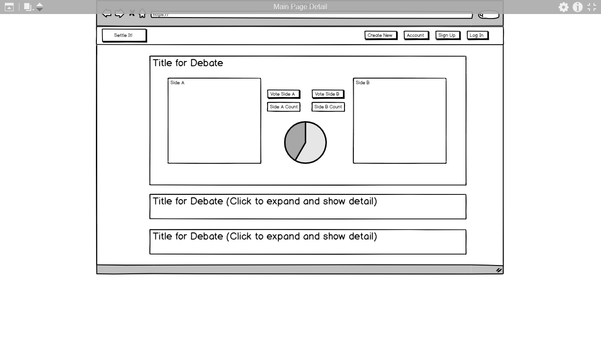

## Settle-It!

<!--  -->

## Project Description

Settle It! allows users to post their side of an argument, invite someone else to post their competing side, and the community then votes on which side is correct. No comments, no endless discussions, put forth your best stance on an issue so that you can finally Settle-It!

## Link to Deployed Site

https://settle-it.herokuapp.com/

## How It Works

Sign up with a username and log in. 

Passport authenticates the user's request for a username and password. In the code, passport.authenticate() is called and a specific strategy is used. If authentication fails, then the users gets an error or 401 unauthorized status. If authentification succeeds, then the user is directed to the home page. The username is compared to user names in the database.

Once logged in, you can view your account, where you can see your active settles, or any settles that others have sent you to respond to. You can also go to the "Create a Settle" page where you can start a debate and then pick a user to invite to respond with their side.

Settles will only show on the main page for others to vote on once both sides have been added to the debate.

Each user can vote on each settle only once.

Starting a settle:

Replying to a settle request:

## Technology Used
HTML, CSS, Materialize, JavaScript, jQuery, Node.js, Express.js, Passport.js, MySQL, Sequelize, Handlebars, balsamiq models.

## Potential improvements to this app and code

Use a single sign-on using an OAuth provider that require token-based credentials to protect access like Facebook, Twitter, or Github.

Display usernames on debates.

Ability to follow debates that you have voted on.

Ability to set a closing date/time on debates so that the results will be locked in at that time and the debate will be settled.

Pie charts to be able to easily visualize results of each debate.

<!-- follow the instructions here https://www.npmjs.com/package/all-contributors-cli 
after intial set up, add people and their icon by using npm run contributers:add -- mnelson doc code
then run the command npm run contributors:generate-->
## Contributors

Thanks goes to these wonderful people ([emoji key](https://github.com/kentcdodds/all-contributors#emoji-key)):
<!-- ALL-CONTRIBUTORS-LIST:START - Do not remove or modify this section -->
<!-- prettier-ignore -->
| [ <b>Chase Holladay</b>](https://www.linkedin.com/in/chaseholladay/) [📖](https://github.com/mnelson13/Settle-It/commits?author=chaseholladay "Documentation") [💻](https://github.com/mnelson13/Settle-It/commits?author=chaseholladay "Code") [🤔](#ideas-chaseholladay "Ideas, Planning, & Feedback") [👀](#review-chaseholladay "Reviewed Pull Requests") | [ <b>Melissa Nelson</b>](https://github.com/mnelson13) [📖](https://github.com/mnelson13/Settle-It/commits?author=mnelson13 "Documentation") [💻](https://github.com/mnelson13/Settle-It/commits?author=mnelson13 "Code") [🤔](#ideas-mnelson13 "Ideas, Planning, & Feedback") [👀](#review-mnelson13 "Reviewed Pull Requests") [🎨](#design-mnelson13 "Design") | [ <b>Matt Gasper</b>](https://github.com/mattypockets) [📖](https://github.com/mnelson13/Settle-It/commits?author=mattypockets "Documentation") [💻](https://github.com/mnelson13/Settle-It/commits?author=mattypockets "Code") [🤔](#ideas-mattypockets "Ideas, Planning, & Feedback") [👀](#review-mattypockets "Reviewed Pull Requests") [🎨](#design-mattypockets "Design") | [ <b>deenobahri12</b>](https://github.com/deenobahri12) [📖](https://github.com/mnelson13/Settle-It/commits?author=deenobahri12 "Documentation") [💻](https://github.com/mnelson13/Settle-It/commits?author=deenobahri12 "Code") [🤔](#ideas-deenobahri12 "Ideas, Planning, & Feedback") [👀](#review-deenobahri12 "Reviewed Pull Requests") | [ <b>Yuval Ashkenazi</b>](https://github.com/Yuvashkenazi) [📖](https://github.com/mnelson13/Settle-It/commits?author=Yuvashkenazi "Documentation") [💻](https://github.com/mnelson13/Settle-It/commits?author=Yuvashkenazi "Code") [🤔](#ideas-Yuvashkenazi "Ideas, Planning, & Feedback") [👀](#review-Yuvashkenazi "Reviewed Pull Requests") [🐛](https://github.com/mnelson13/Settle-It/issues?q=author%3AYuvashkenazi "Bug reports") | [ <b>Spencer Berg</b>](https://github.com/sbd367) [📖](https://github.com/mnelson13/Settle-It/commits?author=sbd367 "Documentation") [💻](https://github.com/mnelson13/Settle-It/commits?author=sbd367 "Code") [🤔](#ideas-sbd367 "Ideas, Planning, & Feedback") [👀](#review-sbd367 "Reviewed Pull Requests") [🐛](https://github.com/mnelson13/Settle-It/issues?q=author%3Asbd367 "Bug reports") |
| :---: | :---: | :---: | :---: | :---: | :---: |
<!-- ALL-CONTRIBUTORS-LIST:END -->
<!-- Thanks goes to these wonderful people ([emoji key](https://github.com/kentcdodds/all-contributors#emoji-key)): -->

<!-- ALL-CONTRIBUTORS-LIST:START - Do not remove or modify this section -->
<!-- prettier-ignore -->
<!-- ALL-CONTRIBUTORS-LIST:END -->

<!-- This project follows the [all-contributors](https://github.com/kentcdodds/all-contributors) specification. Contributions of any kind welcome! -->

### Examples of our wireframes and models

